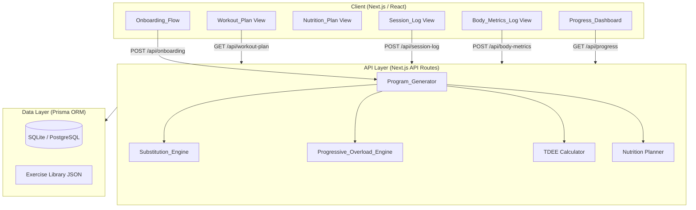

# Design Document: Curated Fitness App

## Overview

The Curated Fitness App is a mobile-first web application that generates personalized workout programs and nutrition plans. It guides users through an onboarding flow, produces tailored plans based on their goals and constraints, and adapts dynamically as users log performance, injuries, and body metrics.

Given the hackathon context (~12 hours), the architecture prioritizes a pragmatic, buildable design: a single-page React application with a lightweight backend (Node.js/Express or Next.js API routes), a simple relational data store (SQLite or PostgreSQL via Prisma), and a rule-based program generation engine rather than an ML model.

### Core User Journey

```
Onboarding → Program Generation → Active Training → Logging → Progress Review → Program Adjustment
```

### Key Design Decisions

1. **Rule-based generation over ML**: Given time constraints, the Program_Generator uses a curated exercise library with tagged metadata and deterministic selection rules. This is faster to build and easier to debug.
2. **Next.js full-stack**: Combines frontend and API in one project, reducing setup overhead.
3. **Prisma + SQLite (dev) / PostgreSQL (prod)**: Simple ORM with schema migrations, easy to swap databases.
4. **Client-side charting**: Recharts for Progress_Dashboard — lightweight and React-native.
5. **No auth complexity**: Simple email/password or anonymous session for hackathon scope.

---

## Architecture



### Request Flow

1. User completes onboarding → `POST /api/onboarding` → Program_Generator runs → Workout_Plan + Nutrition_Plan stored → redirect to dashboard.
2. User opens session → `GET /api/workout-plan/session/:id` → renders exercises with Overload_Recommendations.
3. User logs sets → `POST /api/session-log` → persisted → Progressive_Overload_Engine evaluates on next plan fetch.
4. User logs body metrics → `POST /api/body-metrics` → Weight_Trend recalculated → TDEE/Macro_Targets updated if needed.

---

## Components and Interfaces

### Onboarding_Flow

A multi-step wizard collecting all profile data. Each step maps to a section of the `UserProfile` model.

**Steps:**
1. Goal selection (muscle gain, fat loss, strength, general fitness, sport performance)
2. Training style (bodybuilding, powerlifting, pilates/yoga, body-goal programs for women)
3. Split preference (PPL, Arnold Split, Glute Program, full-body, upper/lower)
4. Experience level (beginner, intermediate, advanced)
5. Physical impediments (multi-select from common list + free text)
6. Sport activity (sport type + weekly hours)
7. Biometrics (age, sex, height, weight, activity level)
8. Nutrition preferences (cuisine, budget, cooking time, ingredient flexibility)
9. Equipment tier selection

Defaults applied for skipped optional fields are surfaced as a summary before submission.

### Program_Generator

The central engine. Accepts a `UserProfile` and returns a `WorkoutPlan` + `NutritionPlan`.

```typescript
interface ProgramGeneratorInput {
  profile: UserProfile;
  progressionData?: ProgressionData; // null on first generation
}

interface ProgramGeneratorOutput {
  workoutPlan: WorkoutPlan;
  nutritionPlan: NutritionPlan;
  tdee: number;
  macroTargets: MacroTargets;
}

function generateProgram(input: ProgramGeneratorInput): ProgramGeneratorOutput
```

**Internal steps:**
1. Calculate TDEE via Mifflin-St Jeor
2. Derive Macro_Targets from goal
3. Select split template
4. Filter exercise library by Equipment_Tier
5. Assign exercises per session, applying impediment substitutions
6. Apply tempo prescriptions if goal is muscle gain
7. Reduce volume for sport activity days
8. Generate nutrition plan from macro targets + preferences

### Substitution_Engine

```typescript
interface SubstitutionRequest {
  exercise: Exercise;
  impediments: PhysicalImpediment[];
  injuries: ActiveInjury[];
  equipmentTier: EquipmentTier;
}

interface SubstitutionResult {
  replacement: Exercise;
  rationale: string; // displayed to user
}

function findSubstitute(req: SubstitutionRequest): SubstitutionResult | null
```

Each exercise in the library carries `contraindications: string[]` and `substitutes: string[]` (exercise IDs). The engine walks the substitute chain filtered by equipment tier.

### Progressive_Overload_Engine

```typescript
interface OverloadAnalysis {
  exerciseId: string;
  recentSessions: SessionLog[];
  currentPrescription: ExercisePrescription;
}

type OverloadRecommendation =
  | { type: 'increase_load'; incrementKg: number }
  | { type: 'increase_reps'; targetReps: number }
  | { type: 'add_set' }
  | { type: 'deload'; reason: string }
  | { type: 'plateau_flag'; options: string[] }
  | null;

function analyseOverload(analysis: OverloadAnalysis): OverloadRecommendation
```

### TDEE Calculator

```typescript
interface BiometricInput {
  age: number;       // years
  sex: 'male' | 'female';
  heightCm: number;
  weightKg: number;
  activityLevel: ActivityLevel; // sedentary | lightly_active | moderately_active | very_active | extra_active
}

// Mifflin-St Jeor equation
function calculateTDEE(input: BiometricInput): number
```

Activity multipliers: sedentary 1.2, lightly active 1.375, moderately active 1.55, very active 1.725, extra active 1.9.

### Progress_Dashboard

Client-side component consuming aggregated data from `GET /api/progress`. Uses Recharts `LineChart` for time-series data.

**Sub-components:**
- `StrengthChart`: per-exercise max load over time
- `BodyweightChart`: bodyweight over time with trend line
- `MeasurementChart`: per-site circumference over time
- `PhotoGallery`: chronological progress photos with side-by-side comparison
- `SummaryCard`: Weight_Trend + top exercises + measurement deltas

---

## Data Models

```prisma
model User {
  id              String   @id @default(cuid())
  email           String?  @unique
  createdAt       DateTime @default(now())
  profile         UserProfile?
  workoutPlan     WorkoutPlan?
  nutritionPlan   NutritionPlan?
  sessionLogs     SessionLog[]
  bodyMetricsLogs BodyMetricsLog[]
  injuryLogs      InjuryLog[]
}

model UserProfile {
  id                  String          @id @default(cuid())
  userId              String          @unique
  user                User            @relation(fields: [userId], references: [id])
  primaryGoal         FitnessGoal
  trainingStyle       TrainingStyle
  splitPreference     SplitType
  experienceLevel     ExperienceLevel
  impediments         String[]        // JSON array of impediment tags
  sportActivity       String?
  sportHoursPerWeek   Float?
  age                 Int
  sex                 Sex
  heightCm            Float
  weightKg            Float
  activityLevel       ActivityLevel
  cuisinePreference   String?
  budgetLevel         BudgetLevel     @default(MEDIUM)
  cookingTimeMinutes  Int?
  ingredientFlexible  Boolean         @default(true)
  equipmentTier       EquipmentTier   @default(BODYWEIGHT_ONLY)
  updatedAt           DateTime        @updatedAt
}

model WorkoutPlan {
  id        String    @id @default(cuid())
  userId    String    @unique
  user      User      @relation(fields: [userId], references: [id])
  sessions  Session[]
  createdAt DateTime  @default(now())
  updatedAt DateTime  @updatedAt
}

model Session {
  id              String               @id @default(cuid())
  workoutPlanId   String
  workoutPlan     WorkoutPlan          @relation(fields: [workoutPlanId], references: [id])
  dayOfWeek       Int                  // 0-6
  sessionName     String               // e.g. "Push A"
  warmupIncluded  Boolean              @default(false)
  exercises       SessionExercise[]
}

model SessionExercise {
  id              String   @id @default(cuid())
  sessionId       String
  session         Session  @relation(fields: [sessionId], references: [id])
  exerciseId      String   // references Exercise in library
  sets            Int
  repsMin         Int
  repsMax         Int
  rpe             Float?
  tempoEccentric  Int?     // seconds
  tempoPause1     Int?
  tempoConcentric Int?
  tempoPause2     Int?
  tutPerSet       Int?     // calculated: (e+p1+c+p2) * repsMin
  notes           String?
  orderIndex      Int
}

model NutritionPlan {
  id           String  @id @default(cuid())
  userId       String  @unique
  user         User    @relation(fields: [userId], references: [id])
  tdee         Float
  calorieTarget Float
  proteinG     Float
  carbsG       Float
  fatG         Float
  meals        Meal[]
  updatedAt    DateTime @updatedAt
}

model Meal {
  id              String        @id @default(cuid())
  nutritionPlanId String
  nutritionPlan   NutritionPlan @relation(fields: [nutritionPlanId], references: [id])
  name            String
  cuisine         String?
  prepTimeMinutes Int
  estimatedCostUsd Float
  proteinG        Float
  carbsG          Float
  fatG            Float
  calories        Float
  ingredients     Json          // array of {name, amount, unit}
  instructions    String
}

model SessionLog {
  id          String       @id @default(cuid())
  userId      String
  user        User         @relation(fields: [userId], references: [id])
  sessionDate DateTime
  sessionId   String?      // reference to planned Session
  sets        SetLog[]
  createdAt   DateTime     @default(now())
  lockedAt    DateTime?    // set to createdAt + 24h; edits blocked after
}

model SetLog {
  id           String     @id @default(cuid())
  sessionLogId String
  sessionLog   SessionLog @relation(fields: [sessionLogId], references: [id])
  exerciseId   String
  setNumber    Int
  repsPerformed Int
  loadKg       Float
  skipped      Boolean    @default(false)
}

model BodyMetricsLog {
  id           String   @id @default(cuid())
  userId       String
  user         User     @relation(fields: [userId], references: [id])
  recordedAt   DateTime @default(now())
  weightKg     Float?
  waistCm      Float?
  hipsCm       Float?
  chestCm      Float?
  leftArmCm    Float?
  rightArmCm   Float?
  leftThighCm  Float?
  rightThighCm Float?
  photoUrl     String?
}

model InjuryLog {
  id           String    @id @default(cuid())
  userId       String
  user         User      @relation(fields: [userId], references: [id])
  bodyArea     String
  severity     Int       // 1-10
  onsetDate    DateTime
  resolvedDate DateTime?
  active       Boolean   @default(true)
}

enum FitnessGoal {
  MUSCLE_GAIN
  FAT_LOSS
  STRENGTH
  GENERAL_FITNESS
  SPORT_PERFORMANCE
}

enum TrainingStyle {
  BODYBUILDING
  POWERLIFTING
  PILATES_YOGA
  BODY_GOAL_WOMEN
}

enum SplitType {
  PPL
  ARNOLD_SPLIT
  GLUTE_PROGRAM
  FULL_BODY
  UPPER_LOWER
}

enum ExperienceLevel {
  BEGINNER
  INTERMEDIATE
  ADVANCED
}

enum Sex {
  MALE
  FEMALE
}

enum ActivityLevel {
  SEDENTARY
  LIGHTLY_ACTIVE
  MODERATELY_ACTIVE
  VERY_ACTIVE
  EXTRA_ACTIVE
}

enum BudgetLevel {
  LOW
  MEDIUM
  HIGH
}

enum EquipmentTier {
  FULL_GYM
  HOME_GYM
  DUMBBELLS_ONLY
  RESISTANCE_BANDS
  BODYWEIGHT_ONLY
}
```

### Exercise Library (Static JSON)

Each exercise entry:

```typescript
interface ExerciseDefinition {
  id: string;
  name: string;
  primaryMuscles: string[];
  secondaryMuscles: string[];
  movementPattern: string;        // e.g. "horizontal_push"
  equipmentTiers: EquipmentTier[]; // tiers that support this exercise
  contraindications: string[];    // impediment/injury tags
  substitutes: string[];          // ordered list of substitute exercise IDs
  technicalComplexity: 'low' | 'medium' | 'high';
  supportsEccentricControl: boolean;
  cues: string[];                 // 3-5 form coaching points
  description: string;
  stepByStep: string[];
}
```

Equipment tier hierarchy (each tier includes all tiers below it):
- `FULL_GYM` ⊇ `HOME_GYM` ⊇ `DUMBBELLS_ONLY` ⊇ `RESISTANCE_BANDS` ⊇ `BODYWEIGHT_ONLY`

---

## Correctness Properties

*A property is a characteristic or behavior that should hold true across all valid executions of a system — essentially, a formal statement about what the system should do. Properties serve as the bridge between human-readable specifications and machine-verifiable correctness guarantees.*

### Property 1: TDEE Calculation Determinism

*For any* valid biometric input (age, sex, height, weight, activity level), calculating TDEE twice with the same inputs SHALL produce the same result.

**Validates: Requirements 2.1**

### Property 2: Macro Targets Sum to TDEE Calories

*For any* valid TDEE value and fitness goal, the derived Macro_Targets (protein, carbs, fat) SHALL sum to within ±5 kcal of the calorie target (using 4 kcal/g for protein and carbs, 9 kcal/g for fat).

**Validates: Requirements 2.2, 2.3**

### Property 3: Equipment Tier Containment

*For any* generated Workout_Plan and Equipment_Tier, every Exercise in the plan SHALL be tagged with an Equipment_Tier that is a subset of or equal to the User's declared Equipment_Tier — no exercise requiring equipment above the user's tier SHALL appear.

**Validates: Requirements 9.1, 9.2, 9.3, 9.4, 9.5, 9.6, 9.7**

### Property 4: Substitution Preserves Equipment Compatibility

*For any* substitution performed by the Substitution_Engine, the replacement Exercise SHALL be executable within the User's Equipment_Profile — the substitution SHALL NOT introduce an exercise requiring equipment the user does not have.

**Validates: Requirements 4.1, 4.6, 10.7**

### Property 5: Injury Substitution Avoids Affected Area

*For any* active InjuryLog entry, no Exercise in the adjusted Workout_Plan SHALL load the body area specified in that InjuryLog entry.

**Validates: Requirements 5.1, 5.2**

### Property 6: Volume Reduction Bound

*For any* InjuryLog entry, the total weekly set count in the adjusted Workout_Plan SHALL be no less than 60% of the pre-injury weekly set count (i.e., the reduction SHALL NOT exceed 40%).

**Validates: Requirements 5.3**

### Property 7: Tempo TUT Calculation Correctness

*For any* Exercise with a Tempo_Prescription (e, p1, c, p2) and prescribed rep count r, the displayed TUT per set SHALL equal (e + p1 + c + p2) × r.

**Validates: Requirements 10.6**

### Property 8: Overload Recommendation Trigger Consistency

*For any* Exercise where the User has completed all prescribed sets and reps at the current load in two consecutive Session_Logs, the Progressive_Overload_Engine SHALL generate an Overload_Recommendation for that Exercise.

**Validates: Requirements 14.1, 14.2**

### Property 9: Overload Recommendation Round-Trip

*For any* accepted Overload_Recommendation, the updated prescription stored in the Workout_Plan SHALL reflect the recommended adjustment — the accepted recommendation and the stored prescription SHALL be consistent.

**Validates: Requirements 14.5**

### Property 10: Meal Macros Aggregate Correctly

*For any* Nutrition_Plan, the sum of protein, carbs, fat, and calories across all meals in a day SHALL equal the displayed daily totals within a rounding tolerance of ±1g per macro and ±5 kcal.

**Validates: Requirements 6.6, 6.7**

### Property 11: Progress Chart Data Completeness

*For any* date range selected on the Progress_Dashboard, every data point displayed in a chart SHALL correspond to an actual logged entry within that date range — no fabricated or out-of-range data points SHALL appear.

**Validates: Requirements 13.1, 13.2, 13.3, 13.4**

### Property 12: Session Log Edit Window

*For any* SetLog entry, an edit SHALL only be accepted if the current time is within 24 hours of the parent SessionLog's creation time — edits outside this window SHALL be rejected.

**Validates: Requirements 11.3**

---

## Error Handling

### Onboarding Errors
- Missing required fields: inline validation with field-level error messages before submission.
- Skipped optional fields: defaults applied silently with a summary notification shown before program generation.

### Program Generation Errors
- No valid exercises found for Equipment_Tier + impediment combination: surface a warning listing the affected muscle groups and suggest upgrading equipment tier or removing an impediment.
- TDEE calculation with extreme inputs (e.g., age < 15 or > 100): clamp to valid range and display a warning.

### Substitution Engine Errors
- No substitute found for a contraindicated exercise within the user's equipment tier: log the gap, skip the exercise, and notify the user that a movement category could not be filled.

### Session Logging Errors
- User closes session without logging a set: prompt "Was this set completed or skipped?" before discarding.
- Edit attempted after 24-hour window: display "Editing window has closed for this session" with the lock timestamp.

### Body Metrics Errors
- Invalid measurement values (negative numbers, implausible ranges): client-side validation rejects entry with a descriptive error.
- Photo upload failure: retry with exponential backoff (3 attempts); if all fail, allow saving the entry without the photo and notify the user.

### Progress Dashboard Errors
- Fewer than 2 data points for a metric: display "Log more data to see your trend" instead of rendering a chart.
- No data in selected date range: display "No data in this period" placeholder.

### Data Deletion
- Progression_Data deletion: require explicit confirmation ("Type DELETE to confirm"), then permanently remove all Body_Metrics_Log and SessionLog entries. Notify user that program adjustments will revert to profile-only defaults.

---

## Testing Strategy

### Unit Tests

Focus on pure functions and business logic:

- **TDEE Calculator**: test Mifflin-St Jeor formula for known male/female inputs; test activity multiplier application; test boundary inputs.
- **Macro Derivation**: test that macros sum to calorie target for each goal type.
- **TUT Calculator**: test tempo × reps formula for various prescriptions.
- **Overload Engine**: test trigger conditions (2 consecutive successes → recommend; 2 consecutive failures → deload flag; 3 stagnant → plateau flag).
- **Equipment Filter**: test that exercises above the user's tier are excluded for each tier level.
- **Substitution Engine**: test that substitutes are within equipment tier; test that substitutes avoid contraindicated movements.
- **Volume Reduction**: test that injury-triggered reduction does not exceed 40%.
- **Session Log Edit Window**: test that edits within 24h are accepted and edits after 24h are rejected.
- **Meal Macro Aggregation**: test that daily totals match sum of individual meals.
- **Progress Chart Data**: test that chart data only includes points within the selected date range.

### Property-Based Tests

Using **fast-check** (TypeScript/JavaScript property-based testing library). Each property test runs a minimum of **100 iterations**.

Each test is tagged with: `// Feature: curated-fitness-app, Property N: <property_text>`

- **Property 1** — TDEE determinism: generate random valid biometric inputs; assert `calculateTDEE(x) === calculateTDEE(x)`.
- **Property 2** — Macro calorie sum: generate random TDEE + goal; assert `protein*4 + carbs*4 + fat*9 ≈ calorieTarget` within ±5 kcal.
- **Property 3** — Equipment tier containment: generate random profiles + equipment tiers; assert all exercises in generated plan are within tier.
- **Property 4** — Substitution equipment safety: generate random substitution requests; assert replacement exercise is within equipment tier.
- **Property 5** — Injury avoidance: generate random injury logs + workout plans; assert no exercise in adjusted plan loads the injured area.
- **Property 6** — Volume reduction bound: generate random injury scenarios; assert adjusted set count ≥ 60% of original.
- **Property 7** — TUT formula: generate random tempo prescriptions and rep counts; assert displayed TUT = (e+p1+c+p2) × reps.
- **Property 8** — Overload trigger: generate random session histories with 2 consecutive full completions; assert recommendation is generated.
- **Property 9** — Overload round-trip: generate random recommendations; accept them; assert stored prescription matches recommendation.
- **Property 10** — Meal macro aggregation: generate random meal sets; assert daily totals match sum within tolerance.
- **Property 11** — Chart data completeness: generate random logs + date ranges; assert all chart points fall within range.
- **Property 12** — Edit window: generate random session logs + edit timestamps; assert edits within 24h succeed and edits after 24h fail.

### Integration Tests

- Full onboarding → program generation pipeline: verify a complete UserProfile produces a non-empty WorkoutPlan and NutritionPlan.
- Session log persistence: verify a logged session is retrievable and associated with the correct user and date.
- Body metrics persistence and TDEE recalculation: verify that submitting a new weight triggers updated Macro_Targets.
- Injury log → substitution pipeline: verify that logging an injury modifies the Workout_Plan and displays the injury indicator.
- Progression data deletion: verify that deletion removes all associated records and the program reverts to profile-only defaults.

### Manual / Exploratory Tests

- Onboarding flow UX: verify all steps render correctly, defaults are applied and surfaced, and the summary screen is accurate.
- Progress_Dashboard charts: verify charts render correctly with 1, 2, and many data points; verify date range filter updates all charts.
- Photo gallery: verify side-by-side comparison works for any two selected entries.
- Injury indicator visibility: verify the indicator is visible on modified sessions while an injury is active.
